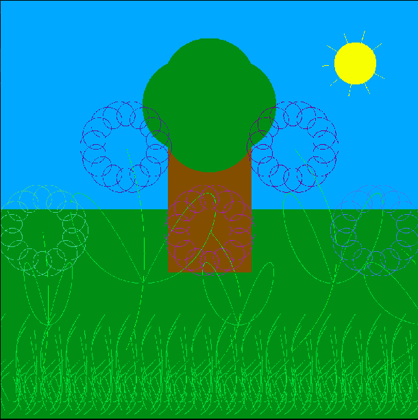

# Infographie

### LANCER LE PROGRAMME 

> gcc Fleur.c -o Fleur.exe -lm 

En sortie, vous aurez une image ppm dans votre fichier.

## BUT

Ce programme génère une image PPM avec des fleurs, un arbre, de l'herbe et un soleil, sous un fond bleu et vert.

Pour cela, nous avons utilisé des Épicycloïde, des courbes de Béziers, segments, etc.

Si vous voulez modifier la taille de l'image. (min 200x200 ; max 1000x1000) 
*dans la main
*fonction surface
*les 2 valeurs en paramètre peuvent être modifié
    

